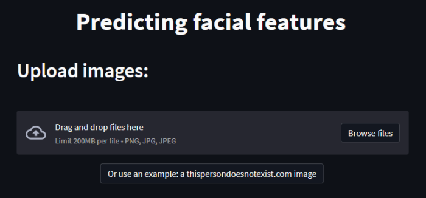

# Predicting facial features web app

Simple web app for user testing a deep neural networks predicting facial features (created for master thesis purposes).

You can preview the app at: [share.streamlit.io](https://share.streamlit.io/konradrydzak/predicting-facial-features-web-app/predicting_facial_features_web_app.py)

## Setup

1. Install required dependencies: `pip install -r requirements.txt`
2. Run program with command: `streamlit run predicting_facial_features_web_app.py`
3. Web app should be running at: http://localhost:8501/

## Screenshots

## Skills used

- knowledge about deep learning in computer vision (with Tensorflow and Keras) - *outside this repo, for master thesis purposes*
- using the streamlit framework for creating a shareable web app
- provided an example use case based on a [thispersondoesnotexist.com](https://thispersondoesnotexist.com/) image

### Possible improvements

- provide a user survey (*unnecessary, because images are highly diverse and saving every image and result takes a lot of space*)
- higher accuracy for model predictions (*endless learning and improvement*)